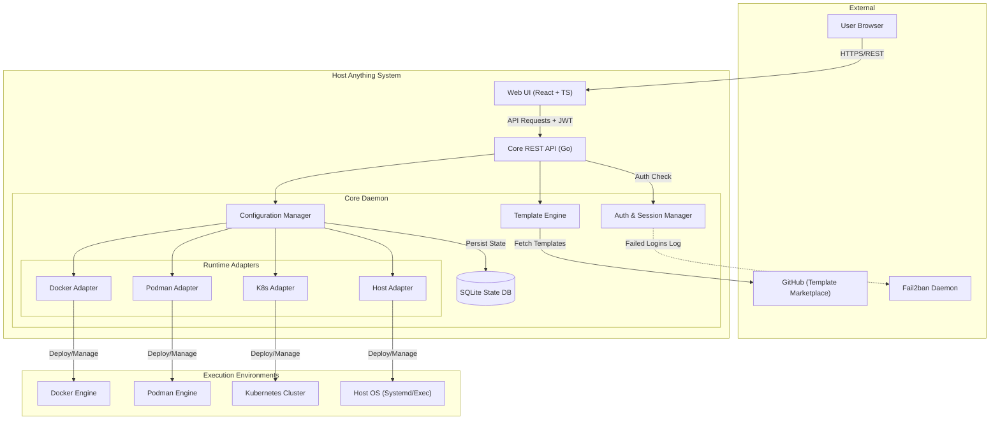

# Host Anything - Architecture Overview

## Introduction
Host Anything is a comprehensive service management platform designed to simplify self-hosting. It abstracts the complexity of deploying and managing applications across various runtimes while strictly adhering to a core philosophy: **Configuration management only, no runtime interference.** The core system manages environment variables, ports, volumes, and resource limits, but leaves the operational runtime logic to the underlying orchestrator (Docker, Podman, Kubernetes, or Host).

## Full System Architecture

## Component Descriptions

1. **Web UI (React + TypeScript)**: A client-side application serving as the primary control plane for users. It provides views for dashboards, service management, template browsing, and configuration.
2. **Core API (Go)**: The entry point for the daemon, exposing RESTful endpoints for the Web UI. It handles authentication, validates requests, and routes them to internal subsystems.
3. **Auth & Session Manager**: Manages JWT-based authentication. It explicitly logs authentication failures in a structured format to a designated log file for Fail2ban to monitor.
4. **Template Engine**: Processes TOML-based template files. It handles fetching templates from the GitHub marketplace, resolving variables, and validating schema before passing instructions to the Config Manager.
5. **Configuration Manager**: The brain of the system. It maps user-defined configurations (ports, volumes, env vars) onto the validated templates and dictates what the adapters should execute.
6. **State Database**: An embedded SQLite database storing the current state of services, configured settings, user accounts, and local template caches.
7. **Runtime Adapters**: A set of polymorphic implementations that translate the Configuration Manager's agnostic instructions into runtime-specific API calls or commands.

## Data Flow
1. **Template Discovery**: User browses the Web UI which requests templates. The Template Engine searches GitHub for repositories matching `hostanything-template-*` and returns metadata.
2. **Service Provisioning**: User selects a template, inputs environment variables and port mappings. The request hits the Core API. The Configuration Manager saves this intended state to SQLite, then invokes the appropriate Runtime Adapter's `Deploy` method.
3. **Execution**: The Runtime Adapter interacts directly with the local Docker daemon, Podman socket, Kubernetes API, or OS process manager to spin up the service using the configured constraints.

## Design Principles
- **Configuration-Level Intervention Only**: Host Anything acts as a high-level conductor. It dictates *what* should run and with *what limits*, but never interferes with the internal process lifecycle (e.g., injecting sidecars, modifying application code).
- **Adapter Pattern**: The core system is blissfully ignorant of container orchestration specifics. All runtime interactions are abstracted behind a rigid Go interface.
- **Template-Driven**: Services are strictly defined by TOML templates, ensuring declarative and reproducible deployments.

## Technology Stack

| Component | Technology | Rationale |
| :--- | :--- | :--- |
| **Backend Core** | Go 1.21+ | Fast, robust concurrency, cross-compilation, single static binary |
| **Frontend UI** | React, TypeScript, Vite | Modern, component-based, strong typing, fast HMR |
| **Data Store** | SQLite (embedded) | Zero-configuration, file-based, sufficient for node-local state |
| **Template Format** | TOML | Highly readable, strongly typed, native Go support |
| **Authentication** | JWT | Stateless sessions, easy to implement and validate |
| **Security** | Fail2ban | Standardized brute-force protection integrated via log files |
| **Distribution** | `.deb` Package | First-class citizen for Debian/Ubuntu based home servers |
