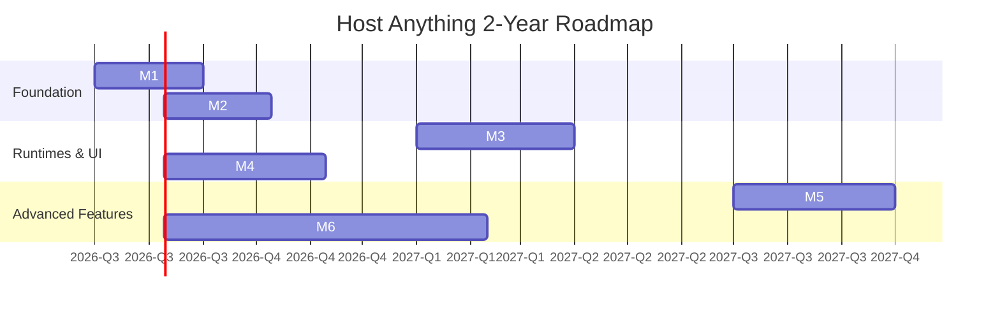

# Roadmap: Host Anything (2-Year Plan)

## Overview
This roadmap outlines the strategic milestones for developing Host Anything from its foundation to a fully mature, multi-runtime service orchestrator with a decentralized template ecosystem.

## Timeline

## Milestones

| Milestone | Target Date | Focus Area | Key Deliverables |
|-----------|-------------|------------|------------------|
| **[M1: Foundation](M1-foundation.md)** | **Completed** | Project infrastructure, Core setup | Go module, CLI setup, config loading, logging, basic API, CI/CD, .deb build script. |
| **[M2: Template Engine](M2-template-engine.md)** | **Completed** | Schema & Configuration | SPEC-001 implementation, TOML parser, schema validation, local registry, variable substitution. |
| **[M3: Docker Runtime](M3-docker-runtime.md)** | **Completed** | Container Orchestration | RuntimeAdapter interface, Docker implementation, deploy/start/stop/logs/config reload. |
| **[M4: Web UI](M4-web-ui.md)** | **Completed** | User Experience | React+TS dashboard, JWT Auth, Fail2ban integration, service management UI, logs viewer. |
| **[M5: Multi-Runtime](M5-multi-runtime.md)** | Q3 2027 | Ecosystem expansion | Podman, Kubernetes, and Host execution adapters. Runtime auto-detection. |
| **[M6: Marketplace](M6-marketplace.md)** | Q4 2027 - Q2 2028 | Ecosystem & Community | GitHub integration, UI marketplace browser, official template library, community guidelines. |

## Success Criteria per Milestone
Detailed success criteria and out-of-scope definitions are maintained within the individual milestone documents linked above. Progress is measured by functional integration tests and CI/CD automated deployments.
