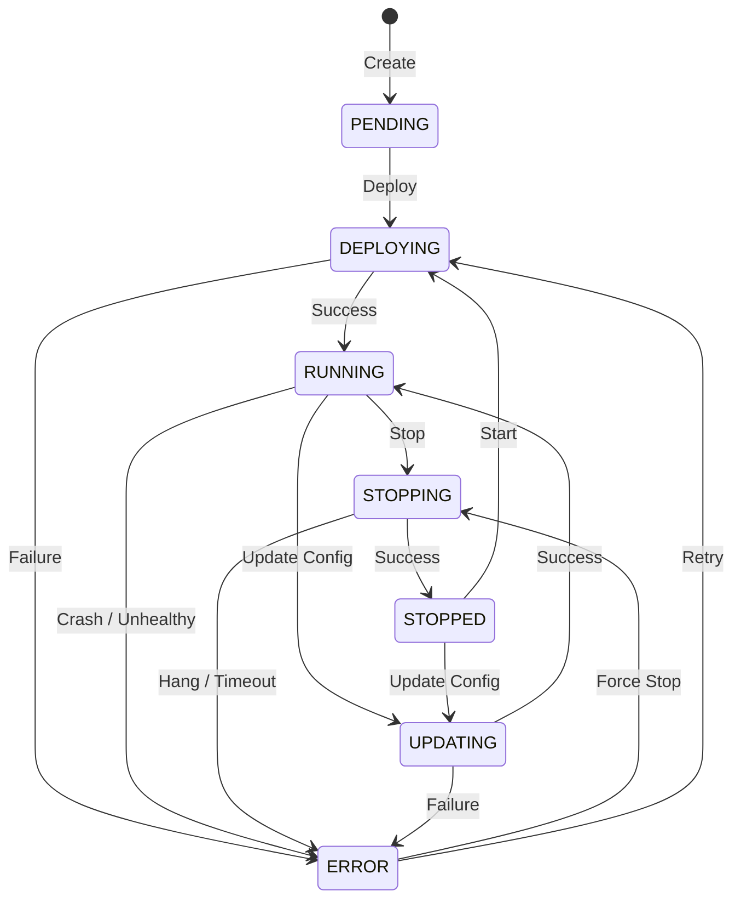

# SPEC-002: Service Lifecycle

## Status
Approved

## Overview
This specification details the lifecycle of a service managed by Host Anything. It defines the finite state machine governing service states, the events that trigger transitions, and the responsibilities of the core engine and runtime adapters at each stage.

## Motivation
To guarantee consistent behavior regardless of the underlying runtime (Docker, Podman, K8s, Host). Abstracting the lifecycle allows the core system to manage complex deployments safely without understanding runtime-specific container or process states.

## Scope
- Definition of valid service states.
- Rules for state transitions.
- Core engine behaviors during transitions.
- Runtime adapter interface contract regarding states.
- Error recovery strategies.

## Out of Scope
- Internal state management of the specific runtimes (e.g., Docker's internal container states beyond what affects Host Anything).

## Specification

### Valid States
- **PENDING**: Service has been created in the database, but deployment has not started.
- **DEPLOYING**: Configuration is being applied, resources provisioned, and runtime adapter is initializing the service.
- **RUNNING**: Service is active and passing health checks.
- **STOPPING**: Service is gracefully shutting down.
- **STOPPED**: Service is inactive/terminated by user request.
- **ERROR**: Service failed to start, crashed, or failed health checks continuously.
- **UPDATING**: Service configuration is being changed.

### State Transition Diagram

### Transition Events and Core Actions
- **Create**: Core writes service metadata to database. State -> PENDING.
- **Deploy**: Core applies config variables, creates volume bindings, and calls `Adapter.Deploy()`. State -> DEPLOYING.
- **Success (Deploy)**: Healthcheck passes. State -> RUNNING.
- **Stop**: Core calls `Adapter.Stop()`. State -> STOPPING.
- **Success (Stop)**: Adapter confirms process/container is gone. State -> STOPPED.
- **Crash**: Adapter event stream reports exit code > 0. State -> ERROR.
- **Update Config**: Core halts (if strategy=recreate), patches config, and calls `Adapter.Update()`. State -> UPDATING.

### Data Schemas
N/A - Core relies on internal finite state machine constructs in Go, recording current state as an enum string in the service metadata store.

### Error Handling
If an operation times out (e.g., DEPLOYING takes > 5 minutes), the core will issue a SIGKILL equivalent via the adapter and move the state to ERROR. The user will be presented with runtime logs detailing the failure point.

### Security
Transitions requiring elevated privileges (like binding port 80) are delegated to the runtime adapter, ensuring the Host Anything core doesn't run with unnecessary privileges during state management.

### Testing Strategy
- State machine unit tests ensuring invalid transitions (e.g., PENDING -> STOPPING) return errors.
- Integration tests using a mock runtime adapter to simulate crashes and ensure the core transitions to ERROR.
- Tests simulating timeout during DEPLOYING state.
